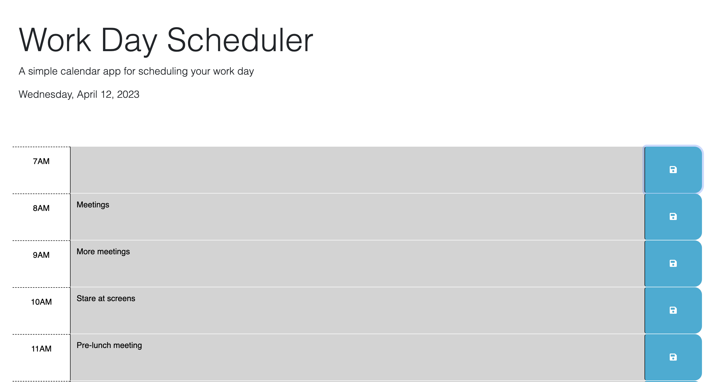
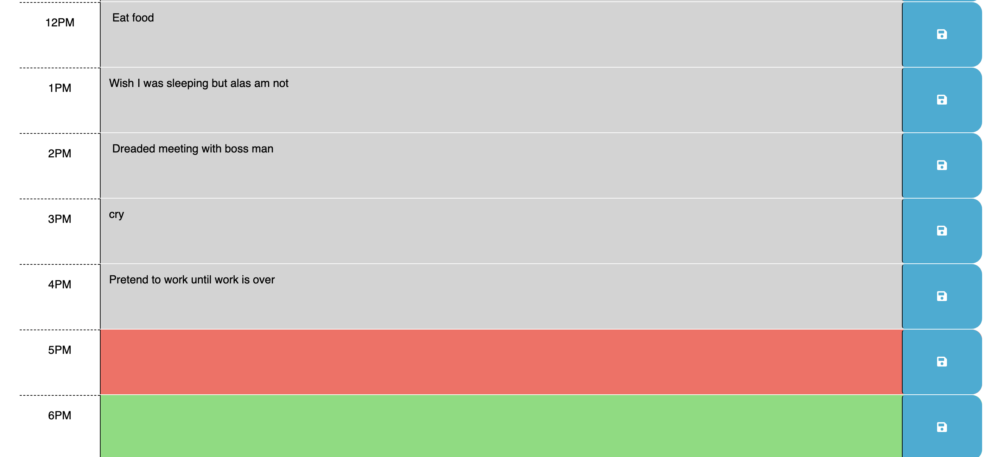

# Work Day Scheduler

## Description

Provide a short description explaining the what, why, and how of your project. Use the following questions as a guide:

- This project was engineered to use day.js and to explore how it can dynamically affect a web page. This was also created so that I can learn how to apply class attributes at specified times or when certain requirements are met. The given code needed to be updated so that each our on the schedule would be a certain color, be it in the future, past, or current. I also needed to make the user-fillable fields, able to take the entered information and store it in local storage. Then, when the page is reloaded, it should display the previously entered information. By fixing these issues, I learned to better traverse the DOM by using JQuery, and how to apply day.js effectively. 

## Table of Contents

- [User Story](#user-story)
- [Acceptance-Criteria](#acceptance-criteria)
- [Usage](#usage)
- [Credits](#credits)
- [License](#license)


## User-Story

```md
AS AN employee with a busy schedule
I WANT to add important events to a daily planner
SO THAT I can manage my time effectively
```

## Acceptance-Criteria

```md
GIVEN I am using a daily planner to create a schedule
WHEN I open the planner
THEN the current day is displayed at the top of the calendar
WHEN I scroll down
THEN I am presented with timeblocks for standard business hours
WHEN I view the timeblocks for that day
THEN each timeblock is color coded to indicate whether it is in the past, present, or future
WHEN I click into a timeblock
THEN I can enter an event
WHEN I click the save button for that timeblock
THEN the text for that event is saved in local storage
WHEN I refresh the page
THEN the saved events persist
```
## Usage

Live site: https://andrewnalley.github.io/calendar/

Enter your schedule into the fields, and they will still be there when you reload the page! The current hour will be highlighted with a certain color, as well as past and future events. 

Photos:




## Credits

https://learn.jquery.com/using-jquery-core/document-ready/

https://api.jquery.com/category/traversing/

https://stackoverflow.com/questions/1827659/get-a-div-value-in-jquery

https://stackoverflow.com/questions/40791207/setting-and-getting-localstorage-with-jquery

https://day.js.org/docs/en/display/format 


## License

MIT License

Copyright (c) [2023] [Andrew Nalley]

Permission is hereby granted, free of charge, to any person obtaining a copy
of this software and associated documentation files (the "Software"), to deal
in the Software without restriction, including without limitation the rights
to use, copy, modify, merge, publish, distribute, sublicense, and/or sell
copies of the Software, and to permit persons to whom the Software is
furnished to do so, subject to the following conditions:

The above copyright notice and this permission notice shall be included in all
copies or substantial portions of the Software.

THE SOFTWARE IS PROVIDED "AS IS", WITHOUT WARRANTY OF ANY KIND, EXPRESS OR
IMPLIED, INCLUDING BUT NOT LIMITED TO THE WARRANTIES OF MERCHANTABILITY,
FITNESS FOR A PARTICULAR PURPOSE AND NONINFRINGEMENT. IN NO EVENT SHALL THE
AUTHORS OR COPYRIGHT HOLDERS BE LIABLE FOR ANY CLAIM, DAMAGES OR OTHER
LIABILITY, WHETHER IN AN ACTION OF CONTRACT, TORT OR OTHERWISE, ARISING FROM,
OUT OF OR IN CONNECTION WITH THE SOFTWARE OR THE USE OR OTHER DEALINGS IN THE
SOFTWARE.

---

